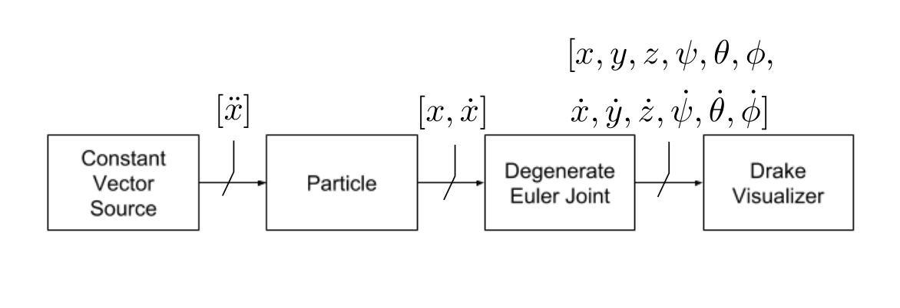

# Particle examples

## Uniformly accelerated particle sample

### Description

This is a demo that creates a very simple system of a 1DOF particle, moving at a constant acceleration.
All relevant quantities can be set through the command line: its initial position and velocity, as
well its acceleration (in SI units). Additionally, simulation time and realtime rate are also exposed
as command line arguments.



### How do I build it?

Follow the instructions in the [README](../../README.md) for this project.

### How do I run it?

```
# Switch to the build directory
cd build/src/particles
# Start the visualiser
/opt/drake/bin/drake_visualizer &
# Run the demo
./uniformly_accelerated_particle [-initial_position 0.0] [-initial_velocity 0.0] [-acceleration 1.0] [-simulation_time +inf] [-realtime_rate 1.0]
```

### Caveats

Feel free to emulate the system framework part of this demo program, but be aware that this is using the
soon-to-be-deprecated rigid body and custom SDF parser which will be replaced by the multi-body API and
the officially upgraded SDF parser from OSRC.
